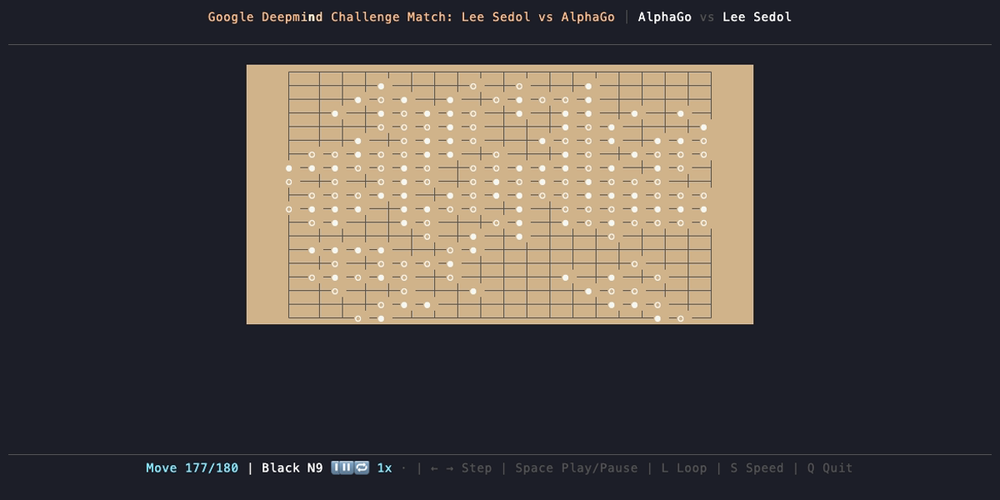

# Smart Game Viewer

A beautiful terminal-based viewer for SGF (Smart Game Format) files, designed for watching professional Go games.




## Features

- Parse and display SGF (Smart Game Format) files
- Navigate through game moves with keyboard controls
- Auto-play mode with adjustable speed (1x / 2x / 3x)
- Playlist mode: play all SGF files in a directory in natural sort order
- Display game information (players, move coordinates)
- Board rotation on loop (180° perspective shift)
- Support for 9x9, 13x13, and 19x19 boards
- Wood-textured board with title shine and star speed animations
- Example games included (AlphaGo vs Lee Sedol)

## Usage

```bash
# Run with an SGF file
cargo run -- examples/AlphaGo_LeeSedol_game4.sgf

# Play all SGF files in a directory (natural sort order)
cargo run -- path/to/sgf/folder/

# Default: scans ./sgf/ if no argument given
cargo run

# Or after building
./target/release/smartgameviewer examples/AlphaGo_LeeSedol_game4.sgf
```

## Controls

- **← / →**: Step backward/forward through moves
- **Home**: Jump to start of game
- **End**: Jump to end of game
- **Space**: Toggle auto-play (automatically advance moves)
- **L**: Toggle looping
- **S**: Cycle playback speed (1x → 2x → 3x → 1x)
- **Q / Esc**: Quit

## Development

This project uses [devenv](https://devenv.sh/) for development environment management.

### Recommended Setup

```bash
# Install devenv (if not already installed)
# See https://devenv.sh/getting-started/

# All cargo commands should be run through devenv shell:
devenv shell cargo build
devenv shell cargo test
devenv shell cargo run -- examples/AlphaGo_LeeSedol_game4.sgf
```

### Common Development Commands

```bash
# Run with example
devenv shell cargo run -- examples/AlphaGo_LeeSedol_game4.sgf

# Run tests
devenv shell cargo test

# Format code
devenv shell cargo fmt

# Run linter
devenv shell cargo clippy

# Build release version
devenv shell cargo build --release
```

**Note:** Using `devenv shell` ensures you have the correct Rust toolchain and all dependencies available.

## Roadmap

- [x] Board background coloring (wood texture)
- [x] Title shine effect and star speed animation
- [ ] Sound: Stone placement sounds
- [ ] GUI version (Tauri/egui)
- [ ] Web version
- [ ] AI engine integration

## License

MIT

## Author

ApisMellow
