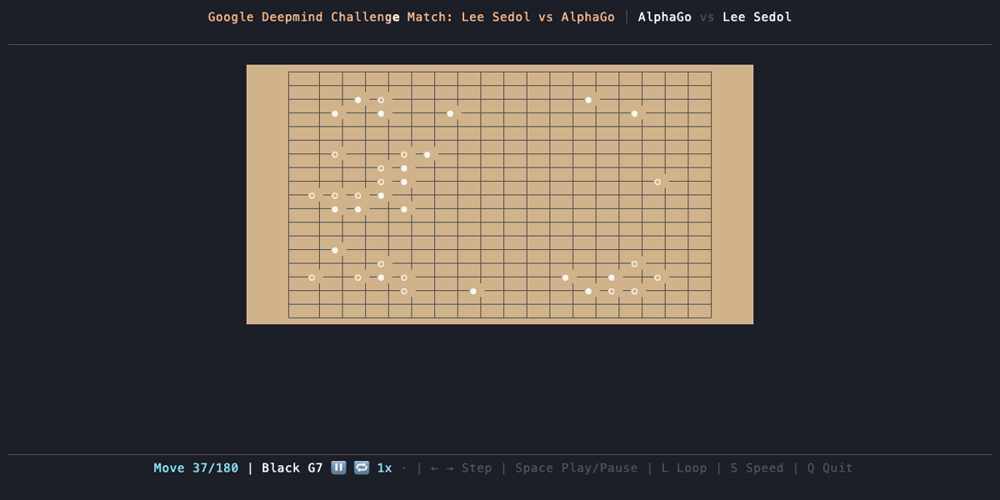
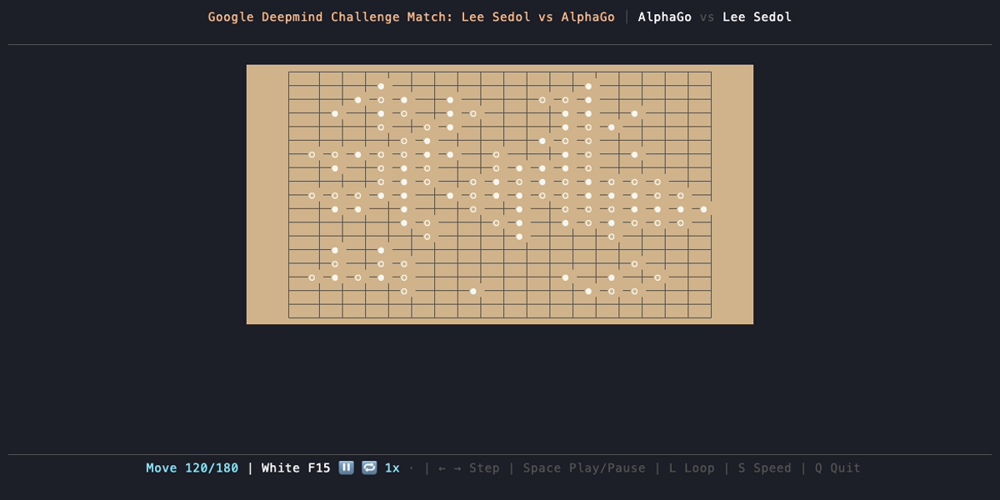

# Smart Game Viewer Demo

*2026-03-04T16:59:05Z by Showboat dev*
<!-- showboat-id: c1085a31-b454-4399-98e9-b54dd2f65eb4 -->

A terminal-based Go game viewer built with Rust and Ratatui. Displays SGF (Smart Game Format) files with auto-play, navigation controls, and board rotation.

## Opening (Move 37)

```bash {image}
\
```



## Midgame (Move 120)

```bash {image}
\
```



## Endgame (Move 177)

```bash {image}
\
```


